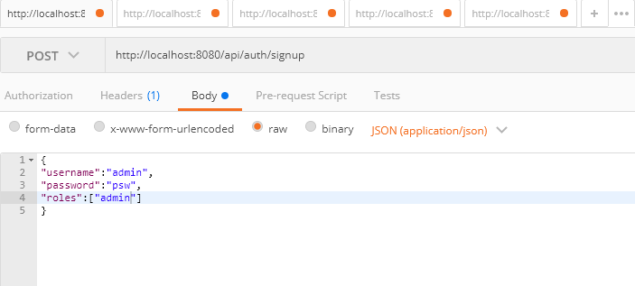
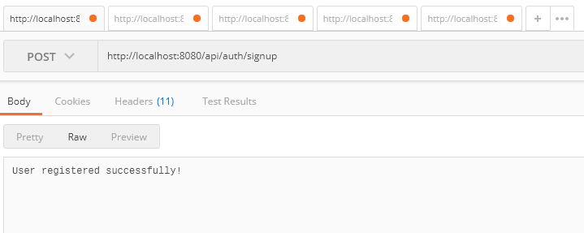
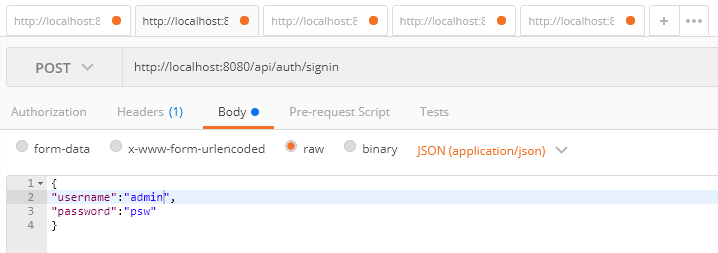
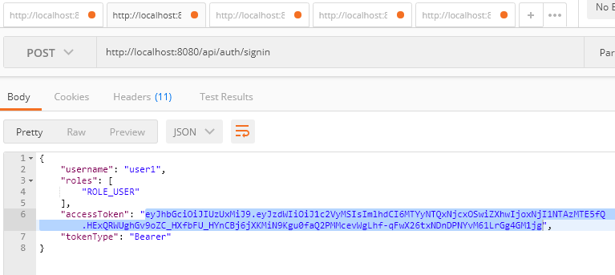
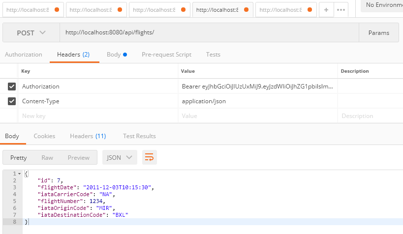

# How to use the endpoints

To call "/flights" endpoints, an Authorization key needs to be added to the header and its value is a JWT that is obtained after sign-in. To sign-in, the user has to be signed-up.
If that is the case, a jwt object is returned, and is to be used in the authorization value, preceded with "Bearer ".

## Use Postman for example

### Sign-up

#### Call

#### Response

### Sign-in

#### Call

#### Response

### Flights endpoint

#### Call && Response

